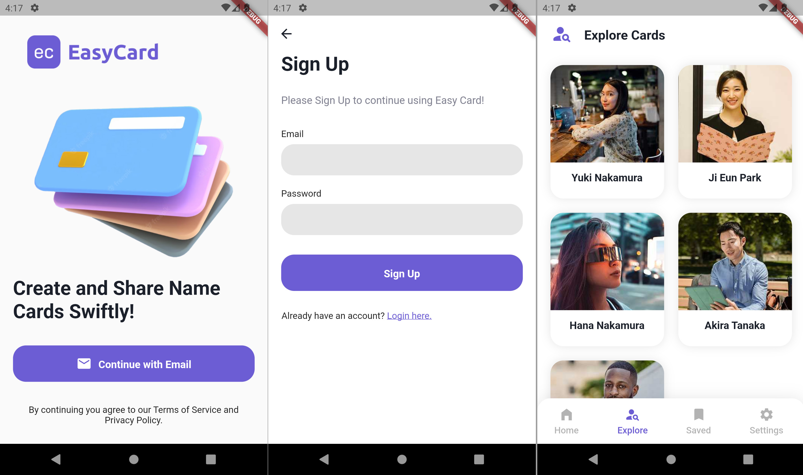
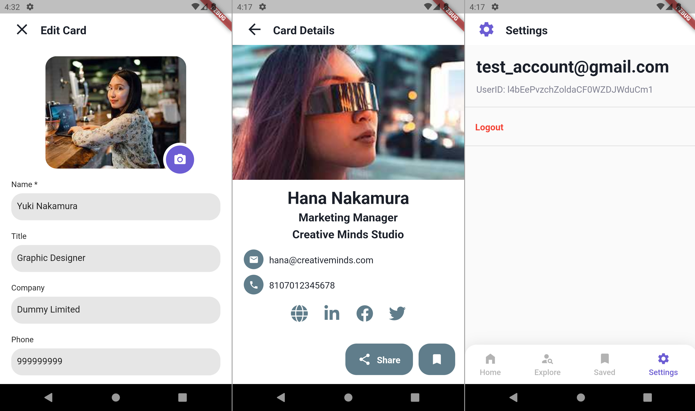

# Easy Card - 

A Flutter native App project for creating and sharing business cards.
[Video Demo](https://youtu.be/J8bEzhNeUBo)



## Tech Stack
- [x] [Flutter](https://flutter.dev/)
- [x] [Dart](https://dart.dev/) for programming language
- [x] [BLoC](https://bloclibrary.dev/) for state management
- [x] [Firebase](https://firebase.google.com/) for authentication, database and photo storage


## App's feature
- User register and authentication
- Allowing Create, Read, Update and Delete actions on cards
- Saving a card to favorite list

## Getting Started

Follow these steps to set up and run the project locally.

Install android simulator and running the prototype by the command below:
```bash
flutter run
```

## To Do:
- [] Build a valid APK and put it online
- [] Finish this Readme
